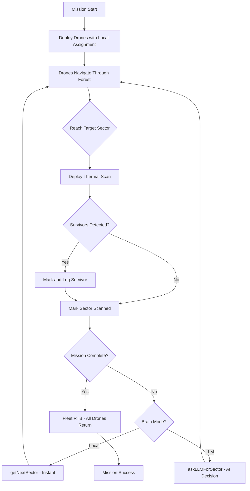

<p align="center">
  <h1 align="center">🔥 SkyRescue AI — Autonomous Drone Swarm for Wildfire Search & Rescue</h1>
  <p align="center">
    <strong>MCP-Powered Multi-Agent System with Real-Time 3D Simulation & LLM Tactical Commander</strong>
  </p>
  <p align="center">
    
    
    
    
    
  </p>
</p>

---

## 🎯 Problem Statement

In wildfire disasters, **every second counts**. Search & Rescue teams face massive, hazardous terrain with limited visibility, toxic smoke, and the constant threat of rapidly spreading fire. Traditional single-drone operations are slow, inefficient, and can't cover enough ground before survivors run out of time.

**SkyRescue AI** solves this by deploying an **autonomous AI-coordinated drone swarm** that intelligently divides, prioritizes, and sweeps disaster zones — finding survivors before it's too late.

---

## 💡 Solution Overview

SkyRescue AI is a **full-stack multi-agent system** that coordinates a fleet of 1–5 rescue drones in a simulated wildfire disaster zone. The system uses the **Model Context Protocol (MCP)** for structured tool communication and **Mistral AI (via LangChain)** as a strategic commander that makes real-time tactical decisions.

### Key Innovation: Two-Brain Architecture

| Layer                            | Technology                    | Role                                                                                 |
| -------------------------------- | ----------------------------- | ------------------------------------------------------------------------------------ |
| **Tactical Brain** (Local) | JavaScript + Heuristic Engine | Instant proximity-based assignment, obstacle avoidance, battery management           |
| **Strategic Brain** (LLM)  | Mistral AI via LangChain      | High-level swarm coordination, survival deadline prioritization, conflict resolution |

Drones deploy **instantly** using local intelligence, and the LLM Commander can **reroute** them in real-time based on evolving battlefield conditions.

---

## ✨ Features

### 🚁 Autonomous Drone Swarm

- **1–5 configurable drones** with independent battery, pathfinding, and decision-making
- **Optimal Swarm Coordination** — Drones evaluate fleet-wide ETA for every sector, ensuring the closest drone (even if busy) is prioritized.
- **Improved Obstacle Avoidance** — Stuck drones exclusively climb vertically to clear canopies, incurring a 5.0% battery penalty for high-energy vertical lift.
- **High-Precision RTB (Return-to-Base)** — Precision battery formulas match the simulation engine's drain exactly for zero-failure returns.
- **Visual Observation Rings** — Live oscillating radius indicators (5 sectors) show exactly what each drone is currently observing.
- **Auto-recharging** — Drones return to base, recharge to 100%, and redeploy automatically

### 🧠 Dual-Brain Intelligence

- **Local Brain**: Greedy proximity + fleet-wide ETA penalty system for instant unit-aware assignments.
- **LLM Brain**: Mistral AI evaluates relative ETA comparisons (e.g., "fastest to reach" or "fallback") to justify tactical assignments.
- **Seamless switching** between Local and LLM modes via UI toggle.
- **Conflict avoidance** — LLM sees all teammate positions/targets and fleet-wide arrival times to prevent duplicate scanning.

### 🔥 Realistic Disaster Environment

- **10×10 sector grid** (200×200 unit terrain) with procedural hazards
- **Fire zones** — 3× battery drain, 60-second survivor deadline
- **Smoke zones** — 1.5× drain, 180-second deadline
- **No-fly zones** — Impassable terrain with dense obstacles
- **Dense 3D forest** with procedural trees, burned stumps, rocks, and a central cabin

### 📡 MCP Tool Integration

Full Model Context Protocol server with **15 tools** that any MCP client can discover and call:

| Category               | Tools                                                          |
| ---------------------- | -------------------------------------------------------------- |
| **Discovery**    | `list_drones`, `get_fleet_status`, `get_environment`     |
| **Navigation**   | `move_to`, `recall_for_charging`                           |
| **Scanning**     | `thermal_scan`, `scan_sector`                              |
| **Intelligence** | `get_tactical_recommendations`, `get_high_level_decision`  |
| **Situational**  | `get_sectors`, `get_unscanned_sectors`, `get_hazard_map` |
| **Mission**      | `reset_mission`, `get_mission_summary`                     |
| **Status**       | `get_battery_status`, `get_status`                         |

### 🖥️ Immersive 3D Simulation

- **Real-time Three.js visualization** with day/night cycle
- **Up to 8 camera modes** — Follow any drone, world view, or swarm tracking camera
- **Live minimap** with drone paths, targets, and scan coverage
- **Chain-of-Thought panel** — Watch each drone's reasoning in real-time
- **MCP Protocol Log** — Toggle to see raw MCP tool calls and responses
- **Mission goal selector** — "Scan All Sectors" or "Find All Survivors"
- **Emergency drone kill** — Manual shutdown with one click

---

## 🏗️ Architecture

```
┌─────────────────────────────────────────────────────────┐
│                   3D Browser Simulation                  │
│              (simulation.html — Three.js)                │
│                                                          │
│  ┌──────────┐ ┌──────────┐ ┌──────────┐ ┌──────────┐   │
│  │  Drone 1 │ │  Drone 2 │ │  Drone 3 │ │  Drone N │   │
│  │  Local   │ │  Local   │ │  Local   │ │  Local   │   │
│  │  Brain*  │ │  Brain*  │ │  Brain*  │ │  Brain*  │   │
│  └────┬─────┘ └────┬─────┘ └────┬─────┘ └────┬─────┘   │
│       │             │             │             │         │
│       └─────────────┴──────┬──────┴─────────────┘         │
│                            │ MCP over SSE                 │
└────────────────────────────┼──────────────────────────────┘
                             │
              ┌──────────────▼──────────────┐
              │      MCP Server (SSE)       │
              │  (run_server.py — FastMCP)  │
              │                             │
              │  15 discoverable MCP tools  │
              │  Calls Mistral AI directly  │
              └──────────────┬──────────────┘
                             │ LangChain
              ┌──────────────▼──────────────┐
              │      Mistral AI (LLM)        │
              │   mistral-large-latest       │
              └─────────────────────────────┘

*\*Local Brain: Heuristic-based autonomous fallback logic running directly in the browser.*
```

---

## 📁 Project Structure

```
vhack-cs3/
├── simulation/
│   ├── simulation.html            # 🖥️  Main 3D simulation (Three.js renderer)
│   └── simulation_engine.py       # ⚙️  Core physics & mission logic
├── agent/
│   └── commander_agent.py         # 🤖 Autonomous LLM Swarm Commander
├── mcp_app/
│   └── mcp_server.py              # 📡 Unified FastMCP Server
├── drone/
│   └── Drone.py                   # 🚁 Drone flight & battery model
├── start.py                       # 🚀 Lifecycle script (Server + UI)
└── README.md                      # 📖 This file
```

---

## 🚀 Quick Start

### Prerequisites

- **Python 3.11+**
- **Mistral AI API Key** — Get one free at [console.mistral.ai](https://console.mistral.ai)
- **Node.js 18+** — For the MCP Inspector (optional)
- A modern browser (Chrome, Firefox, Edge)

### 1. Project Setup

```bash
git clone https://github.com/YOUR_USERNAME/vhack-cs3.git
cd vhack-cs3

# Install dependencies
pip install fastapi uvicorn langchain-mistralai langchain-core pydantic mcp
```

### 2. Launch the Environment (Terminal 1)

This script starts the MCP server and automatically opens the 3D simulation in your default browser.

```bash
# Set your Mistral API key
export MISTRAL_API_KEY=your_api_key_here

# Start the server + UI
python start.py
```

### 3. Deploy the Autonomous Commander (Terminal 2)

Once the simulation is running, launch the agent to take control of the swarm.

```bash
# Run the autonomous brain
python agent/orchestrator.py
```

### 4. Run the Mission

1. **Configure** — Set survivor count (1–15), drone count (1–5), and mission goal
2. **Click "▶ Start Simulation"** — Drones deploy immediately
3. **Toggle Brain Mode** — Click `🧠 Brain: Local` to switch to `🧠 Brain: LLM` for AI-powered decisions
4. **Watch in Browser** — Use camera buttons or keys `0-7` to follow individual drones or view the swarm
5. **Monitor Terminal** — Watch the LLM's **Chain-of-Thought** and explicit fleet-wide ETA analysis in the terminal.

### 5. (Optional) MCP Inspector

To explore the tools via the inspector, you must point it to the SSE endpoint:

```bash
# Launch the MCP Inspector
npx -y @modelcontextprotocol/inspector
```
Then in the inspector UI, connect to `http://localhost:8000/sse` using the **SSE** transport option.

---

## ⌨️ Controls

| Key / Button  | Action                                      |
| ------------- | ------------------------------------------- |
| `0`         | All drones view (chain-of-thought merged)   |
| `1`–`5`  | Follow drone 1–5                           |
| `6`         | World overview (top-down)                   |
| `7`         | Swarm tracking camera (auto-follows fleet)  |
| `H`         | Toggle scanned sector highlighting          |
| `🧠 Brain`  | Switch between Local and LLM decision modes |
| `🌙 / ☀️` | Toggle day/night lighting                   |
| `⏸ Pause`  | Pause/resume simulation                     |
| `KILL`      | Emergency shutdown for individual drones    |

---

## 🔬 How It Works

### Mission Flow



### Decision Intelligence

**Local Brain** uses a scoring function:

```
score = distance × priority_multiplier
```

Where `priority_multiplier` is: Fire = 0.1 (highest priority), Smoke = 0.5, Clear = 1.0.
It also performs battery feasibility checks before assignment.

**LLM Brain** receives:

- Drone's battery and position
- All teammates' positions and current targets
- Top 10 tactical candidates with survival deadlines and distances
- Returns a JSON decision with reasoning

---

## 🛡️ Resilience Features

| Feature                          | Description                                                   |
| -------------------------------- | ------------------------------------------------------------- |
| **Fleet ETA Sync**         | Drones only claim sectors if they are truly the fastest to reach them |
| **Hallucination Override** | Orchestrator vetoes and overrides LLM recalls if drone has >30% battery |
| **Vertical Canopy Escape** | Drones rise to 25u altitude + battery penalty to clear obstacles (no backtracking) |
| **Battery Safety Net**     | High-precision RTB formulas with safety margin overhead       |
| **Stuck Detection**        | If a drone moves < 1 unit in 40 frames, it triggers escape    |
| **Sector Locking**         | Assigned sectors are locked globally to prevent duplicate scans |
| **Observation Radius**     | Optimized 5-sector radius for real-time hazard detection       |

---

---

## 📦 Dependencies

| Package                 | Purpose                                |
| ----------------------- | -------------------------------------- |
| `fastapi`             | HTTP server for LLM decision endpoints |
| `uvicorn`             | ASGI server                            |
| `langchain-mistralai` | Mistral AI LLM integration             |
| `langchain-core`      | LangChain message types                |
| `pydantic`            | Request/response validation            |
| `mcp`                 | Model Context Protocol SDK             |

---

## 🏆 Built For

**VHack 2026** — AI/MCP Track

---

## 📜 License

MIT License — See [LICENSE](LICENSE) for details.
